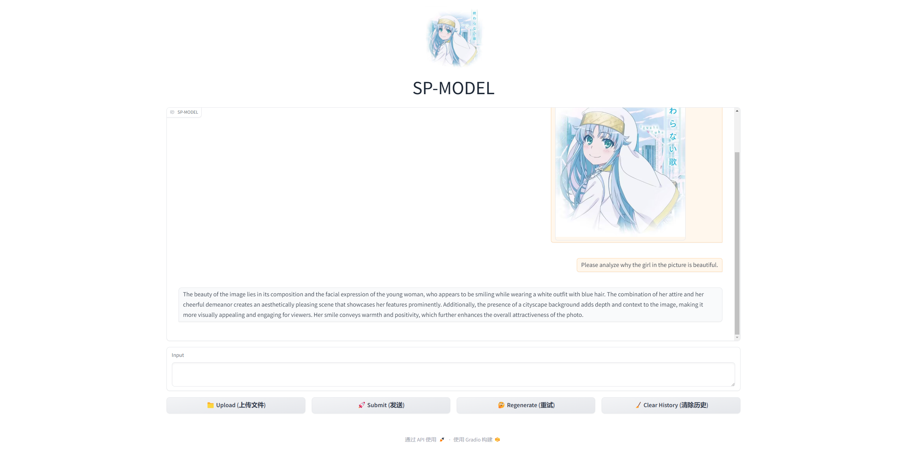
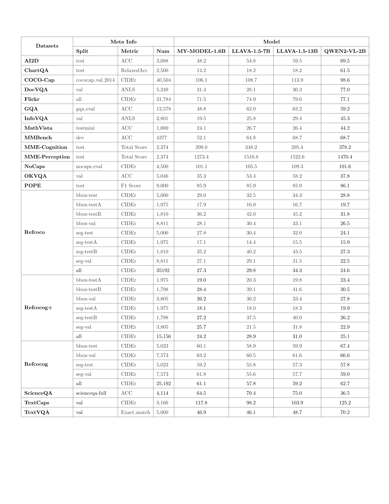

## Demo



## Tips

The most important thing: Remember to modify the paths in the code to your own!

### Pretrain

- I used the alignment data from [LLAVA(595K)](https://huggingface.co/datasets/liuhaotian/LLaVA-Instruct-150K).

- The training hyperparameters are the same as those used in LLAVA training.

### SFT

- I filtered the [LLAVA instruction fine-tuning data(525K)](https://huggingface.co/datasets/liuhaotian/LLaVA-Instruct-150K) and kept only the data with fewer than 8 dialogue turns.
- The training hyperparameters are the same as those used in LLAVA training.

### RLHF

- I did not train a reward model and used the DPO (Direct Preference Optimization) method instead.

- The training data used is the [RLHF-V](https://huggingface.co/datasets/openbmb/RLHF-V-Dataset) dataset.

- To perform DPO (Direct Preference Optimization), some modifications to the source code of the codebase are required.

  ```python
  # transformers/trainer.py line3838        
  if self.processing_class is not None:
              pass
              # self.processing_class.save_pretrained(output_dir)
          
  # trl/trainer/dpo_trainer.py Near line 727
  tokenizer -> tokenizer.tokenizer
  
  ```

### Benchmark

- I used [lmms-eval](https://github.com/EvolvingLMMs-Lab/lmms-eval) to compare my model (1.6B) with QWEN2-VL-2B, LLAVA-V1.5-7B, and LLAVA-V1.5-7B across 19 datasets. The results show that my model, with fewer training datas, performs nearly on par with LLAVA, surpassing it in some aspects, but lags behind the latest QWEN2-VL-2B in certain areas.
- Simply downloading the evaluation library is not enough to evaluate my model; you need to add `qwen_llama.py` in the models directory (I've already added it) and register the model.

### WEB UI

- The interface is built using the gradio library.

### RAG

- The dataset used is [emo-visual-data](https://github.com/LLM-Red-Team/emo-visual-data/tree/master?tab=readme-ov-file).
- The embedding model used is [bge-m3](https://huggingface.co/BAAI/bge-m3).

### COT

- Since I am not deeply familiar with reinforcement learning, I directly used instruction fine-tuning from the dataset for training, and the dataset used is [LLaVA-CoT-o1-Instruct](https://huggingface.co/datasets/5CD-AI/LLaVA-CoT-o1-Instruct).
- The model's loss converged well to 0.7 in the first epoch, and it demonstrated good reasoning ability during testing.
- The evaluation results are at the end of the README.
 
### Quantization

- I used the AWQ code for quantization.

## Run

### Pretrain

```sh
sh Pretrain_SFT_Downstream/pretrain.sh
```

### SFT

```sh
sh Pretrain_SFT_Downstream/instruct.sh
```

### RLHF

```sh
sh RLHF/rlhf.sh
```

### Benchmark

```sh
sh Benchmark/lmms-eval/llama_qwen.sh
```

### WEB UI

```sh
python3 WebUI/web_demo_mm.py
```

### RAG

```sh
python3 test_rag.py
```

### COT

```sh
python3 Cot/process_dataset.py
sh Cot/cot.sh
```

### Quantization

```sh
quantization.ipynb
```

## Evaluation results

